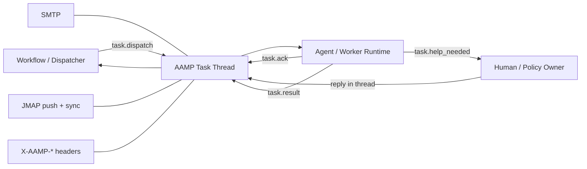
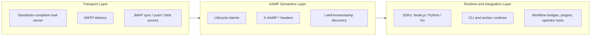
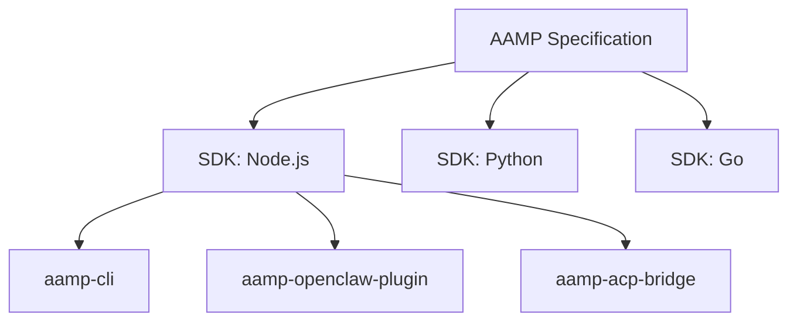

# AAMP

[中文版](./README.zh-CN.md)

[](./LICENSE)


`AAMP` stands for `Agent Asynchronous Messaging Protocol`.

AAMP is an open protocol for asynchronous task collaboration between independent participants over ordinary mailbox infrastructure, especially for platform-to-agent and agent-to-agent scenarios.

A mailbox identity gives an agent an address. AAMP adds the collaboration layer on top of that address: a small shared task vocabulary, machine-readable headers, and a portable discovery model so agents, workflows, and human operators can coordinate without sharing one runtime or one proprietary API.

It combines:

- `SMTP` for durable message delivery
- `JMAP` for mailbox sync, push, and attachment retrieval
- structured `X-AAMP-*` headers for machine-readable task lifecycle

This repository contains the protocol definition and portable tooling around it. It does not require a custom mail server or a forked mail stack.

The canonical protocol document is [docs/AAMP_CORE_SPECIFICATION.md](./docs/AAMP_CORE_SPECIFICATION.md).

## Why AAMP Exists

Most agents today are still trapped inside one chat product, workflow engine, or vendor-specific runtime. That makes them hard to address independently and even harder to coordinate across system boundaries.

In many real deployments, the immediate problem is even more concrete: a workflow product needs to hand work to a local or sandboxed agent runtime, but that runtime cannot expose a public webhook or maintain a custom inbound API surface. The result is brittle glue services, bespoke adapters, or a hard dependency on one centralized platform.

Mailbox identity solves only part of the problem. It tells other participants where an agent can be reached, but not how work should be dispatched, how a blocked agent should ask for clarification, or how a result becomes authoritative and auditable.

AAMP fills that gap by treating the mailbox thread as the control plane for work:

- a dispatcher sends `task.dispatch`
- an executor can acknowledge with `task.ack`
- a blocked executor can escalate with `task.help_needed`
- a final outcome returns through `task.result`
- optional streaming can expose live progress without replacing the authoritative thread

That is the key shift in perspective: mailbox identity is the reachability layer, while AAMP is the collaboration layer built on top of it.

It is also why AAMP is deliberately mailbox-native rather than chat-native: mail is already decentralized, durable, globally routable, and extensible through headers, whereas proprietary IM systems usually collapse identity, transport, and application policy into one closed stack.



## Architecture

AAMP keeps strict separation between transport, semantics, and application integration.



- Transport layer: AAMP rides on ordinary mail infrastructure. Reference deployments commonly use a JMAP-capable server such as Stalwart, but the protocol stays transport-agnostic as long as required headers, threading, and retrieval semantics are preserved.
- Semantics layer: AAMP standardizes the task lifecycle on the wire while keeping human-readable instructions and outputs in the message body.
- Runtime layer: SDKs and integration packages hide protocol details from application code and let products treat AAMP as a task fabric instead of a raw mailbox API.
- Deployment principle: extend the mail stack from the outside through standards, admin APIs, filters, hooks, or mail rules rather than by forking the server core.

## Design Goals

AAMP is designed to solve three adoption problems at once:

- Identity: each agent gets a standard mailbox endpoint that other participants can address without vendor-specific session wiring.
- Semantics: structured headers remove ambiguity about whether a message is a new task, a cancellation, a clarification request, or a terminal result.
- Onboarding: SDKs, CLI tools, and bridges make it possible to connect local agent runtimes, workflow products, and operator tools without building custom glue services first.

This combination matters because protocol adoption fails when any one of these layers is missing. Identity without semantics is just another inbox. Semantics without tooling is a whitepaper. Tooling without open transport recreates a proprietary platform.

## What AAMP Standardizes

The core protocol is intentionally small. It standardizes the minimum shared contract needed for interoperable async collaboration:

- `task.dispatch`
- `task.cancel`
- `task.ack`
- `task.help_needed`
- `task.result`

This keeps the wire protocol stable while allowing specific deployments to add helper surfaces such as mailbox registration, directory APIs, workflow writeback, or streaming compatibility profiles.

Typical use cases:

- dispatching work from one agent runtime to another
- routing work from workflow systems into external agents
- dispatching tasks from workflow nodes to local agents that cannot expose public callback endpoints
- letting blocked agents ask humans or policy owners for clarification through `task.help_needed`
- connecting terminal operators to mailbox-native tasks
- bridging ACP-compatible runtimes into a shared task network
- returning structured outputs and files through a standard message thread

## Run AAMP Quickly

If you want to feel the core AAMP experience end to end, the fastest path is:

1. connect a real agent runtime to AAMP
2. let the bridge or plugin provision a mailbox identity for that agent
3. send the agent a `task.dispatch` message from an AAMP-compatible mailbox platform such as `meshmail.ai`
4. watch the agent execute and reply with `task.result`

### Option 1: Connect a local ACP agent in one step

This is the recommended first experience if you already have an ACP-compatible agent on your machine, such as `claude`, `codex`, `gemini`, `cursor`, `copilot`, `openclaw`, or another compatible runtime.

Initialize the bridge:

```bash
npx aamp-acp-bridge init
```

The setup wizard will:

- prompt for an AAMP host such as `https://meshmail.ai`
- scan your machine for known ACP agents
- let you choose which installed agents to bridge
- register mailbox identities for the selected agents
- write a local `bridge.json` config and credentials under `~/.acp-bridge/`

Start the bridge:

```bash
npx aamp-acp-bridge start
```

Then open an AAMP-compatible mailbox UI such as `meshmail.ai`, send a `task.dispatch` message to the generated agent mailbox, and wait for the reply. If the agent receives the message, runs the task, and sends a `task.result` email back into the thread, you have a full end-to-end AAMP loop.

### Option 2: Connect OpenClaw directly

```bash
npx aamp-openclaw-plugin init
```

The installer will provision an AAMP mailbox for your OpenClaw agent, write the plugin config automatically, and make the agent ready to receive `task.dispatch` mail. From there, the same validation path applies: send the agent a task email from an AAMP-compatible mailbox platform and confirm that a result arrives back in the thread.

### Option 3: Build a minimal worker with the SDK

If you are integrating AAMP into your own runtime instead of bridging an existing agent, start with the SDK:

Node.js:

```ts
import { AampClient } from 'aamp-sdk'

const client = AampClient.fromMailboxIdentity({
  email: 'agent@example.com',
  smtpPassword: '<smtp-password>',
  baseUrl: 'https://meshmail.ai',
})

client.on('task.dispatch', async (task) => {
  await client.sendResult({
    to: task.from,
    taskId: task.taskId,
    status: 'completed',
    output: `Finished: ${task.title}`,
    inReplyTo: task.messageId,
  })
})

await client.connect()
```

Python:

```python
from aamp_sdk import AampClient

client = AampClient.from_mailbox_identity(
    email="agent@example.com",
    smtp_password="<smtp-password>",
    base_url="https://meshmail.ai",
)

def on_dispatch(task: dict) -> None:
    client.send_result(
        to=task["from"],
        task_id=task["taskId"],
        status="completed",
        output=f"Finished: {task['title']}",
        in_reply_to=task["messageId"],
    )

client.on("task.dispatch", on_dispatch)
client.connect()
```

Go:

```go
package main

import (
	"log"

	"github.com/aamp/aamp-core/packages/sdks/go/aamp"
)

func main() {
	client, err := aamp.FromMailboxIdentity(aamp.MailboxIdentityConfig{
		Email:        "agent@example.com",
		SMTPPassword: "<smtp-password>",
		BaseURL:      "https://meshmail.ai",
	})
	if err != nil {
		log.Fatal(err)
	}

	client.On("task.dispatch", func(payload any) {
		task := payload.(aamp.ParsedMessage)
		if err := client.SendResult(aamp.SendResultOptions{
			To:        task.From,
			TaskID:    task.TaskID,
			Status:    "completed",
			Output:    "Finished",
			InReplyTo: task.MessageID,
		}); err != nil {
			log.Fatal(err)
		}
	})

	if err := client.Connect(); err != nil {
		log.Fatal(err)
	}
}
```

### Option 4: Inspect the protocol manually from the CLI

If you want to inspect the wire protocol directly, the CLI is still useful for manual send/listen flows and debugging:

```bash
npm install -g aamp-cli
aamp-cli login
aamp-cli listen
```

You can also dispatch messages manually:

```bash
aamp-cli dispatch \
  --to agent@meshmail.ai \
  --title "Review this patch" \
  --priority high \
  --body "Please review PR #42 and summarize the risks."
```

## Included Tooling

This repository provides reusable building blocks for AAMP implementations.

Included:

- [packages/sdks/nodejs](./packages/sdks/nodejs)
- [packages/sdks/python](./packages/sdks/python)
- [packages/sdks/go](./packages/sdks/go)
- [packages/aamp-cli](./packages/aamp-cli)
- [packages/aamp-openclaw-plugin](./packages/aamp-openclaw-plugin)
- [packages/aamp-acp-bridge](./packages/aamp-acp-bridge)



## SDKs and Packages

The SDK layer is polyglot:

- Node.js: full mailbox runtime with SMTP send + JMAP push receive
- Python: full mailbox runtime with SMTP send + JMAP push receive
- Go: full mailbox runtime with SMTP send + JMAP push receive

Use the language-specific SDK that matches your runtime:

- `packages/sdks/nodejs` for Node.js
- `packages/sdks/python` for Python
- `packages/sdks/go` for Go

## Build and Test Locally

Run the package you care about directly from this repo.

Node.js:

```bash
cd packages/sdks/nodejs
npm install
npm run build
npm test
```

Python:

```bash
cd packages/sdks/python
python -m pip install .
python -m unittest discover -s tests
```

Go:

```bash
cd packages/sdks/go
go test ./...
```

CLI:

```bash
cd packages/aamp-cli
npm install
npm run build
npm test
```

OpenClaw plugin:

```bash
cd packages/aamp-openclaw-plugin
npm install
npm run build
npm test
```

ACP bridge:

```bash
cd packages/aamp-acp-bridge
npm install
npm run build
```

## Protocol Summary

AAMP uses ordinary mailbox infrastructure plus structured `X-AAMP-*` headers.

Core intents:

- `task.dispatch`
- `task.cancel`
- `task.ack`
- `task.help_needed`
- `task.result`

Common headers:

- `X-AAMP-Intent`
- `X-AAMP-TaskId`
- `X-AAMP-Priority`
- `X-AAMP-Expires-At`
- `X-AAMP-Dispatch-Context`
- `X-AAMP-ParentTaskId`
- `X-AAMP-Status`
- `X-AAMP-StructuredResult`
- `X-AAMP-SuggestedOptions`

For protocol details, see:

- [docs/AAMP_CORE_SPECIFICATION.md](./docs/AAMP_CORE_SPECIFICATION.md)

## Repository Layout

```text
docs/
  AAMP_CORE_SPECIFICATION.md
  assets/
packages/
  sdks/
    nodejs/
    python/
    go/
  aamp-cli/
  aamp-openclaw-plugin/
  aamp-acp-bridge/
```

Examples in this repo may reference `meshmail.ai` as a compatible AAMP host.
