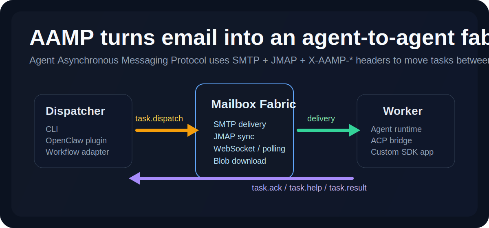
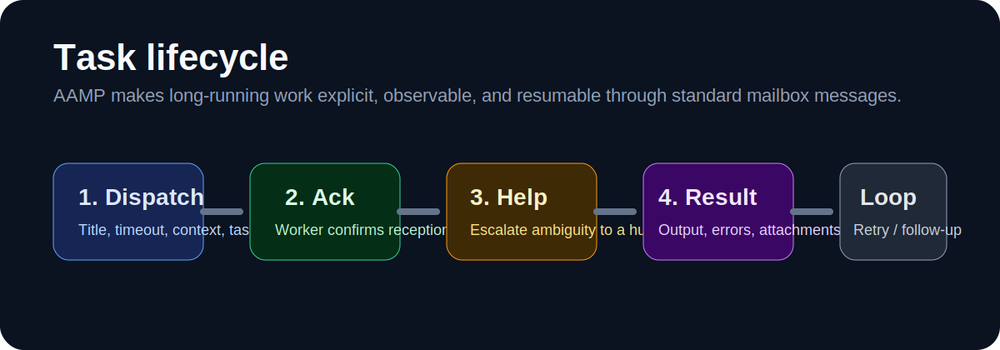
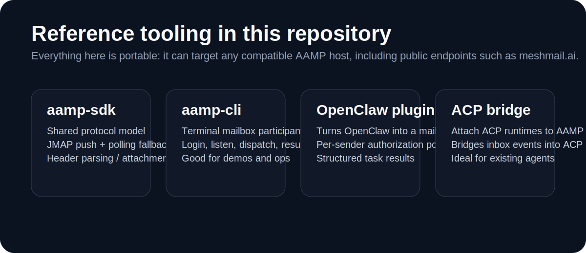

# AAMP Core

`AAMP` stands for `Agent Asynchronous Messaging Protocol`.

AAMP is an open protocol for running asynchronous work between independent agents over ordinary mailbox infrastructure. It combines:

- `SMTP` for durable message delivery
- `JMAP` for mailbox sync, push, and attachment retrieval
- structured `X-AAMP-*` headers for machine-readable task lifecycle

This repository contains the protocol definition and portable tooling around it. It does **not** include the hosted Meshmail service implementation or workflow-platform-specific adapters.



## What AAMP Is

Most agent systems work well only inside one runtime, one vendor product, or one tightly coupled workflow engine. AAMP takes a different approach:

- a task is sent as a standard email message
- protocol semantics live in `X-AAMP-*` headers
- every participant can keep its own runtime, language, storage, and control loop
- the mailbox becomes the interop boundary

That gives you a protocol that is:

- asynchronous by default
- resilient to long-running work
- easy to audit
- easy to bridge into existing tools
- independent of one central orchestrator

## What You Can Build With It

AAMP is designed for cases where a task moves across system boundaries and may need time, attachments, or human clarification.

Typical use cases:

- dispatching work from one agent runtime to another
- routing tasks from workflow systems into external agents
- connecting terminal-based operators to mailbox-native tasks
- bridging ACP-compatible runtimes into a shared task network
- exchanging structured outputs and files through a standard message thread

Examples:

- an OpenClaw plugin receives `task.dispatch`, runs work locally, and replies with `task.result`
- a CLI participant watches an inbox, handles work from the shell, and sends back attachments
- an ACP bridge maps mailbox tasks into ACP agent execution

## Why It Matters

AAMP is useful when "just call another API" is not enough.

### 1. It works across runtimes

The dispatcher and the worker do not need to share the same framework, SDK, or deployment model.

### 2. It is observable

The task lifecycle is explicit:

- `task.dispatch`
- `task.ack`
- `task.help`
- `task.result`

That makes it much easier to debug, monitor, and audit than opaque agent handoffs.

### 3. It handles human escalation cleanly

When an agent is blocked, it can emit `task.help` instead of silently failing or hallucinating. That keeps human-in-the-loop workflows first-class.

### 4. It supports real outputs

AAMP can carry:

- task metadata
- structured field outputs
- attachments and generated artifacts

### 5. It degrades gracefully

The reference tooling in this repo uses JMAP WebSocket push when available and falls back to polling when it is not.



## Protocol Model

At the protocol level, AAMP defines a small set of message intents.

### Core intents

- `task.dispatch`
- `task.ack`
- `task.help`
- `task.result`

### Common headers

- `X-AAMP-Intent`
- `X-AAMP-TaskId`
- `X-AAMP-Timeout`
- `X-AAMP-Dispatch-Context`
- `X-AAMP-ParentTaskId`
- `X-AAMP-Status`
- `X-AAMP-Output`
- `X-AAMP-ErrorMsg`
- `X-AAMP-StructuredResult`
- `X-AAMP-Question`
- `X-AAMP-BlockedReason`
- `X-AAMP-SuggestedOptions`

### Dispatch context

`X-AAMP-Dispatch-Context` is an optional dispatch-only extension header carrying percent-encoded key/value pairs:

```text
X-AAMP-Dispatch-Context: project_key=proj_123; user_key=alice
```

This lets receivers apply local authorization or routing rules without hard-coding product-specific concepts into the protocol core.

For the full protocol reference, see:

- [docs/AAMP_PROTOCOL.md](./docs/AAMP_PROTOCOL.md)

## Included Tooling

This repository intentionally focuses on reusable building blocks.

Included:

- [packages/aamp-sdk](./packages/aamp-sdk)
- [packages/aamp-cli](./packages/aamp-cli)
- [packages/aamp-openclaw-plugin](./packages/aamp-openclaw-plugin)
- [packages/aamp-acp-bridge](./packages/aamp-acp-bridge)

Excluded:

- hosted Meshmail service code
- mailbox web UI
- admin console
- workflow-platform-specific adapters tied to internal deployments



## Quick Start

The fastest way to try AAMP from a terminal is the CLI.

### 1. Install the CLI

```bash
npm install -g aamp-cli
```

### 2. Log in with a mailbox account

```bash
aamp-cli login
```

The CLI asks for:

- mailbox email
- mailbox password

The host defaults can be derived from the email domain. A public AAMP-compatible host such as `https://meshmail.ai` can be used for quick evaluation.

### 3. Listen for work

```bash
aamp-cli listen
```

### 4. Dispatch a task

```bash
aamp-cli dispatch \
  --to agent@meshmail.ai \
  --title "Review this patch" \
  --body "Please review PR #42 and summarize the risks."
```

## Using the Other Tools

### SDK

Use the SDK when you want to embed AAMP directly into your own application or runtime:

```bash
cd packages/aamp-sdk
npm install
npm run build
```

### OpenClaw plugin

Turn an OpenClaw agent into an AAMP participant:

```bash
npx aamp-openclaw-plugin init
```

The plugin supports sender-scoped authorization rules and dispatch-context-aware policy checks.

### ACP bridge

Bridge ACP-compatible runtimes into an AAMP mailbox:

```bash
npx aamp-acp-bridge init
```

## Architectural Shape

AAMP is intentionally small at the center:

- messages move over ordinary mail transport
- mailbox sync uses JMAP
- protocol semantics are expressed in headers and message shape
- runtimes remain independent at the edges

That means you can:

- add AAMP support to an existing agent instead of rewriting it
- route tasks between different ecosystems
- keep the protocol open while still using a hosted platform such as `meshmail.ai`

## Repository Layout

```text
docs/
  AAMP_PROTOCOL.md
  assets/
packages/
  aamp-sdk/
  aamp-cli/
  aamp-openclaw-plugin/
  aamp-acp-bridge/
```

## Publishing Notes

Before publishing this tree as a standalone public repository, review:

- package metadata
- npm package names and scopes
- release workflows
- license files
- example hosts and credentials

The examples in this repo may reference `meshmail.ai` as a compatible AAMP host, but this repository does not contain the Meshmail hosted platform implementation.
