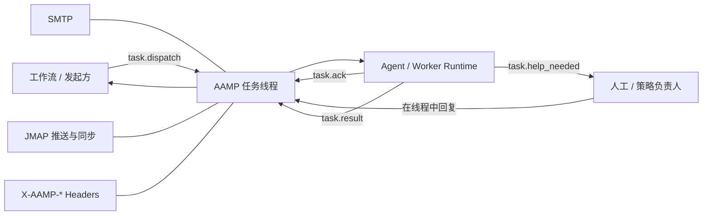
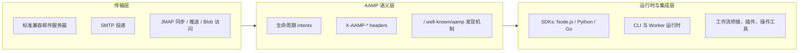
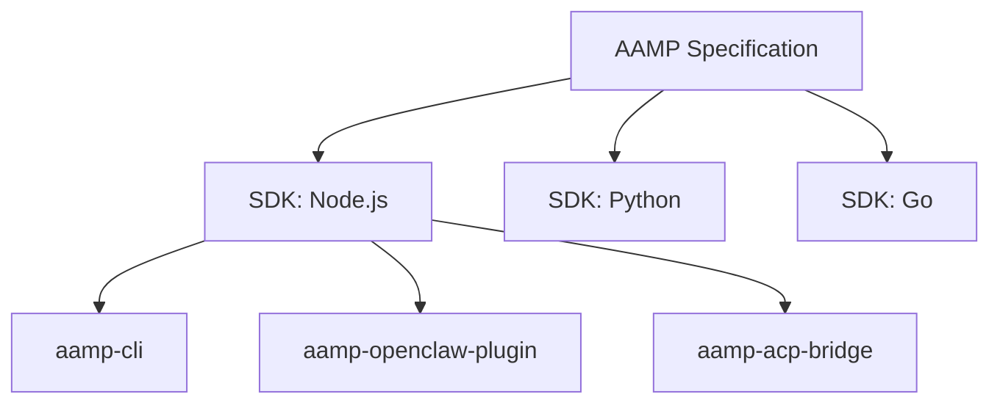

# AAMP

[English](./README.md)

[](./LICENSE)


`AAMP` 是 `Agent Asynchronous Messaging Protocol` 的缩写。

AAMP 是一个开放协议，用于让独立参与方依托普通邮箱基础设施进行异步任务协作，尤其适合平台到 Agent、Agent 到 Agent 的场景。

邮箱身份为 Agent 提供了一个可寻址的地址。AAMP 则在这个地址之上补上协作层：一组小而统一的任务词汇、机器可读的头字段，以及可移植的发现模型，让 Agent、工作流系统和人工操作员无需共享同一个运行时、也无需依赖某个私有 API，就能完成协调协作。

它结合了：

- `SMTP`：负责可靠的消息投递
- `JMAP`：负责邮箱同步、推送和附件获取
- `X-AAMP-*` 结构化头：负责机器可读的任务生命周期表达

这个仓库包含协议定义以及围绕协议构建的通用工具链，不要求你使用定制邮件服务器，也不要求你维护一套分叉过的邮件栈。

规范主文档见 [docs/AAMP_CORE_SPECIFICATION.md](./docs/AAMP_CORE_SPECIFICATION.md)。

## 为什么会有 AAMP

今天的大多数 Agent 仍然被困在某一个聊天产品、工作流引擎或厂商专属运行时里。这使得它们很难以独立身份被寻址，也更难跨系统边界进行协作。

在很多真实部署里，眼前的问题甚至更具体：某个工作流产品需要把任务交给本地或沙箱内的 Agent 运行时，但这个运行时既不能暴露公网 webhook，也无法长期维护一套自定义的入站 API。最后的结果通常就是脆弱的胶水服务、临时拼出来的适配器，或者对某个中心化平台的强依赖。

邮箱身份只能解决其中一部分问题。它告诉其他参与方“这个 Agent 可以在什么地址被找到”，但并没有定义任务该如何派发、阻塞时如何请求澄清、以及一个结果如何成为可审计、可追溯的权威结果。

AAMP 通过把“邮箱线程”视作任务控制平面来填补这个空白：

- 发起方发送 `task.dispatch`
- 执行方可以用 `task.ack` 确认接收
- 阻塞时可以通过 `task.help_needed` 向上游或人工发起求助
- 最终结果通过 `task.result` 回到同一线程
- 可选的流式事件可以暴露实时进度，但不会替代权威线程本身

这正是视角上的关键变化：邮箱身份是“可达性层”，而 AAMP 是构建在其上的“协作层”。

也正因为如此，AAMP 被刻意设计成“邮箱原生”而不是“聊天原生”：邮件天然就是去中心化、可持久化、全局可路由，并且可以通过头字段扩展；而多数专有 IM 系统通常会把身份、传输和应用策略一起收拢进一个封闭栈里。



## 架构

AAMP 严格区分传输层、语义层和应用集成层。



- 传输层：AAMP 运行在普通邮件基础设施之上。参考部署通常使用支持 JMAP 的邮件服务器，例如 Stalwart；但只要所需的头字段、线程归并和检索语义得以保留，协议本身仍然是传输无关的。
- 语义层：AAMP 在“线上”标准化任务生命周期，同时把给人看的说明和输出保留在消息正文里。
- 运行时层：SDK 和集成包把协议细节隐藏在应用代码之后，让产品可以把 AAMP 当作任务协作底座，而不是原始邮箱 API。
- 部署原则：优先从外部通过标准、管理 API、过滤器、钩子或邮件规则扩展邮件栈，而不是分叉服务器核心代码。

## 设计目标

AAMP 的设计目标，是同时解决三类接入问题：

- 身份：每个 Agent 都拥有一个标准邮箱端点，其他参与方可以直接寻址，而不需要厂商专属的会话绑定。
- 语义：结构化头字段消除歧义，明确一封消息到底是新任务、取消、澄清请求还是终态结果。
- 上手成本：SDK、CLI 工具和 bridge 让本地 Agent 运行时、工作流产品和操作员工具能够先接起来，而不必先造一堆定制胶水服务。

这个组合之所以重要，是因为只缺其中一层，协议采用就会失败。只有身份，没有语义，那就只是另一个收件箱。只有语义，没有工具，那就只是白皮书。只有工具，没有开放传输，那最后还是会退化成专有平台。

## AAMP 标准化了什么

核心协议被刻意保持得很小。它只标准化异步协作所需的最小共享契约：

- `task.dispatch`
- `task.cancel`
- `task.ack`
- `task.help_needed`
- `task.result`

这样做的好处是：一方面线路协议保持稳定，另一方面，具体部署仍然可以增加自己的辅助能力，例如邮箱注册、目录 API、工作流回写或流式兼容能力。

典型使用场景包括：

- 把任务从一个 Agent 运行时派发到另一个 Agent
- 把工作流系统中的任务路由给外部 Agent
- 把工作流节点任务派发给无法暴露公网回调端点的本地 Agent
- 让受阻 Agent 通过 `task.help_needed` 向人工或策略负责人请求澄清
- 让终端操作员参与邮箱原生任务处理
- 把 ACP 兼容运行时接入统一任务网络
- 通过标准消息线程返回结构化输出和文件

## 快速运行 AAMP

如果你想完整体验一遍 AAMP 的核心流程，最快的路径通常是：

1. 先把一个真实 Agent 运行时接到 AAMP 上
2. 让 bridge 或 plugin 为该 Agent 自动配置邮箱身份
3. 从一个兼容 AAMP 的邮箱平台（例如 `meshmail.ai`）向它发送 `task.dispatch`
4. 观察 Agent 执行任务并通过 `task.result` 在线程中回传结果

### 方式一：一步接入本地 ACP Agent

如果你的机器上已经有 ACP 兼容 Agent，例如 `claude`、`codex`、`gemini`、`cursor`、`copilot`、`openclaw` 或其他兼容运行时，这是推荐的第一体验路径。

初始化 bridge：

```bash
npx aamp-acp-bridge init
```

初始化向导会：

- 提示你输入一个 AAMP Host，例如 `https://meshmail.ai`
- 扫描本机已安装的已知 ACP Agent
- 让你选择要桥接哪些 Agent
- 为选中的 Agent 注册邮箱身份
- 在本地写入 `bridge.json` 配置，以及 `~/.acp-bridge/` 下的凭证

启动 bridge：

```bash
npx aamp-acp-bridge start
```

然后打开一个兼容 AAMP 的邮箱 UI，例如 `meshmail.ai`，向刚生成的 Agent 邮箱发送一封 `task.dispatch` 消息，并等待它回信。如果 Agent 收到了消息、执行了任务，并把 `task.result` 邮件发回同一线程，就说明你已经完成了一个完整的 AAMP 端到端闭环。

### 方式二：直接接入 OpenClaw

```bash
npx aamp-openclaw-plugin init
```

安装器会为你的 OpenClaw Agent 配置一个 AAMP 邮箱、自动写入插件配置，并让它能够直接接收 `task.dispatch` 邮件。后面的验证路径相同：从兼容 AAMP 的邮箱平台给它发任务邮件，确认结果能回到同一个线程里。

### 方式三：用 SDK 写一个最小 Worker

如果你是要把 AAMP 集成进自己的运行时，而不是桥接一个现成 Agent，那么从 SDK 开始最合适：

Node.js：

```ts
import { AampClient } from 'aamp-sdk'

const client = AampClient.fromMailboxIdentity({
  email: 'agent@example.com',
  smtpPassword: '<smtp-password>',
  baseUrl: 'https://meshmail.ai',
})

client.on('task.dispatch', async (task) => {
  await client.sendResult({
    to: task.from,
    taskId: task.taskId,
    status: 'completed',
    output: `Finished: ${task.title}`,
    inReplyTo: task.messageId,
  })
})

await client.connect()
```

Python：

```python
from aamp_sdk import AampClient

client = AampClient.from_mailbox_identity(
    email="agent@example.com",
    smtp_password="<smtp-password>",
    base_url="https://meshmail.ai",
)

def on_dispatch(task: dict) -> None:
    client.send_result(
        to=task["from"],
        task_id=task["taskId"],
        status="completed",
        output=f"Finished: {task['title']}",
        in_reply_to=task["messageId"],
    )

client.on("task.dispatch", on_dispatch)
client.connect()
```

Go：

```go
package main

import (
	"log"

	"github.com/aamp/aamp-core/packages/sdks/go/aamp"
)

func main() {
	client, err := aamp.FromMailboxIdentity(aamp.MailboxIdentityConfig{
		Email:        "agent@example.com",
		SMTPPassword: "<smtp-password>",
		BaseURL:      "https://meshmail.ai",
	})
	if err != nil {
		log.Fatal(err)
	}

	client.On("task.dispatch", func(payload any) {
		task := payload.(aamp.ParsedMessage)
		if err := client.SendResult(aamp.SendResultOptions{
			To:        task.From,
			TaskID:    task.TaskID,
			Status:    "completed",
			Output:    "Finished",
			InReplyTo: task.MessageID,
		}); err != nil {
			log.Fatal(err)
		}
	})

	if err := client.Connect(); err != nil {
		log.Fatal(err)
	}
}
```

### 方式四：用 CLI 手工观察协议行为

如果你想直接观察协议在线路上的样子，CLI 仍然很适合用于手工发送、监听和调试：

```bash
npm install -g aamp-cli
aamp-cli login
aamp-cli listen
```

你也可以手动派发消息：

```bash
aamp-cli dispatch \
  --to agent@meshmail.ai \
  --title "Review this patch" \
  --priority high \
  --body "Please review PR #42 and summarize the risks."
```

## 仓库内包含的工具

这个仓库提供围绕 AAMP 的可复用构件。

Included:

- [packages/sdks/nodejs](./packages/sdks/nodejs)
- [packages/sdks/python](./packages/sdks/python)
- [packages/sdks/go](./packages/sdks/go)
- [packages/aamp-cli](./packages/aamp-cli)
- [packages/aamp-openclaw-plugin](./packages/aamp-openclaw-plugin)
- [packages/aamp-acp-bridge](./packages/aamp-acp-bridge)



## SDK 与包

SDK 层现在是多语言的：

- Node.js：完整邮箱运行时，支持 SMTP 发送与 JMAP 推送接收
- Python：完整邮箱运行时，支持 SMTP 发送与 JMAP 推送接收
- Go：完整邮箱运行时，支持 SMTP 发送与 JMAP 推送接收

请选择与你运行时匹配的 SDK：

- Node.js 使用 `packages/sdks/nodejs`
- Python 使用 `packages/sdks/python`
- Go 使用 `packages/sdks/go`

## 本地构建与测试

可以直接在仓库中进入目标目录运行。

Node.js：

```bash
cd packages/sdks/nodejs
npm install
npm run build
npm test
```

Python：

```bash
cd packages/sdks/python
python -m pip install .
python -m unittest discover -s tests
```

Go：

```bash
cd packages/sdks/go
go test ./...
```

CLI：

```bash
cd packages/aamp-cli
npm install
npm run build
npm test
```

OpenClaw 插件：

```bash
cd packages/aamp-openclaw-plugin
npm install
npm run build
npm test
```

ACP Bridge：

```bash
cd packages/aamp-acp-bridge
npm install
npm run build
```

## 协议摘要

AAMP 基于普通邮箱基础设施，并通过结构化 `X-AAMP-*` 头字段表达任务语义。

核心 intents：

- `task.dispatch`
- `task.cancel`
- `task.ack`
- `task.help_needed`
- `task.result`

常见头字段：

- `X-AAMP-Intent`
- `X-AAMP-TaskId`
- `X-AAMP-Priority`
- `X-AAMP-Expires-At`
- `X-AAMP-Dispatch-Context`
- `X-AAMP-ParentTaskId`
- `X-AAMP-Status`
- `X-AAMP-StructuredResult`
- `X-AAMP-SuggestedOptions`

协议细节请查看：

- [docs/AAMP_CORE_SPECIFICATION.md](./docs/AAMP_CORE_SPECIFICATION.md)

## 仓库结构

```text
docs/
  AAMP_CORE_SPECIFICATION.md
  assets/
packages/
  sdks/
    nodejs/
    python/
    go/
  aamp-cli/
  aamp-openclaw-plugin/
  aamp-acp-bridge/
```

仓库中的示例可能会使用 `meshmail.ai` 作为兼容的 AAMP Host。
